<h1 align="center">StrainDAQ</h1>
<h3 align="center">Digital Strain Measurement and Data Acquisition System</h3>

<p align="center">
An embedded instrumentation platform for accurate strain measurement using a Wheatstone Bridge, HX711, Raspberry Pi and Analog Discovery 3.
</p>

---


<p align="center">
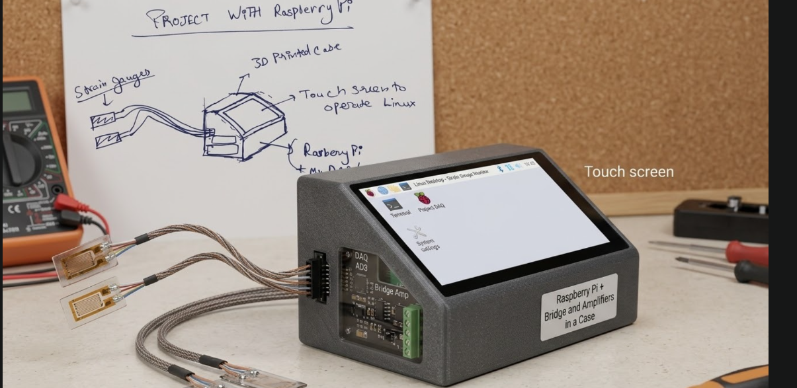
</p>

---

# Project Demonstration

## 🎥 Demo Video

[calibration video](Media/calibration_video.mp4)


---

# Project Overview

StrainDAQ (**Strain Data Acquisition**) is an embedded instrumentation project developed to accurately measure mechanical strain using a **350 Ω foil strain gauge**, **Wheatstone bridge**, **HX711 24-bit ADC**, **Raspberry Pi**, and **Analog Discovery 3**.

The project focuses on designing a complete signal acquisition chain—from sensing mechanical deformation to displaying digital measurements.

---

# System Architecture

<p align="center">
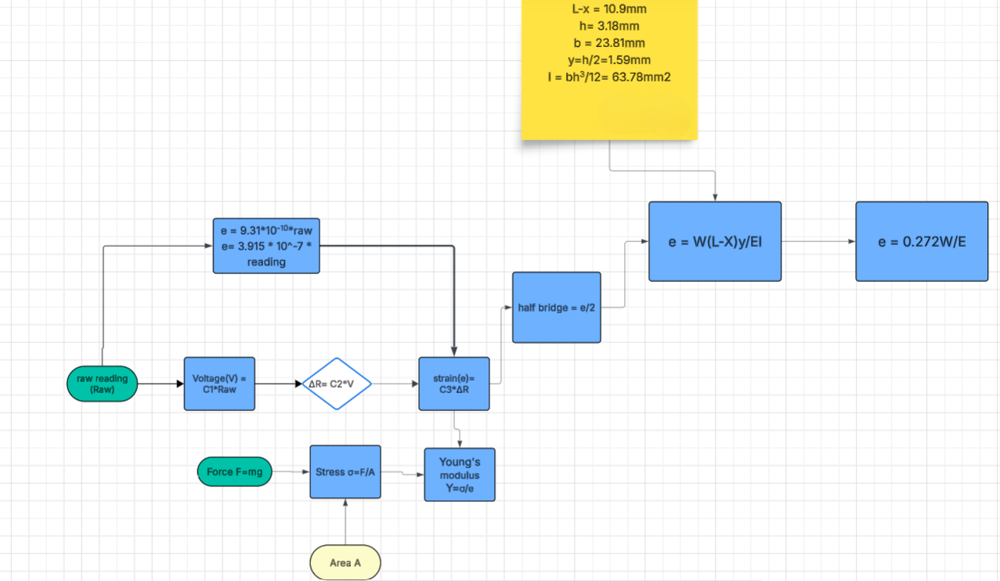
</p>

---

# Working with Y3 Module

```
Mechanical Load
        │
        ▼
 Beam Deformation
        │
        ▼
350 Ω Strain Gauge
        │
        ▼
    Y3 Module 
        │
        ▼
Analog Discovery 3
        │
        ▼
 Raspberry Pi
        │
        ▼
       GUI
```
---
# Working with custom wheatstone

```
Mechanical Load
        │
        ▼
 Beam Deformation
        │
        ▼
350 Ω Strain Gauge
        │
        ▼
Wheatstone bridge 
        │
        ▼       
 Microcontroller
        │
        ▼
       GUI
```
---

# Hardware Components

| Component | Purpose |
|-----------|----------|
| 350 Ω Strain Gauge | Strain sensing |
| Wheatstone Bridge | Resistance-to-voltage conversion |
| HX711 | Signal amplification |
| Raspberry Pi | Processing |
| Analog Discovery 3 | Y3 Module data aqauisition |

---

# Hardware Gallery

| Component | Image |
|-----------|-------|
| Strain Gauge | 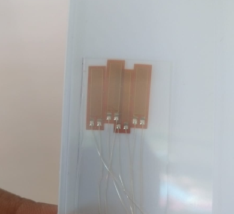 |
| Wheatstone Bridge | 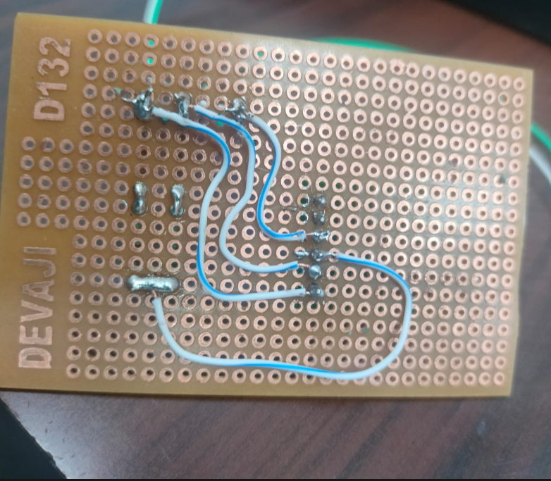 |
|Analog Discovery3|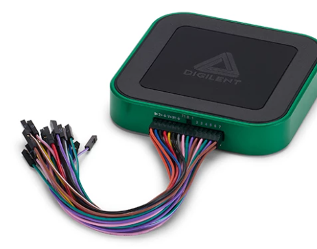|
| HX711 | 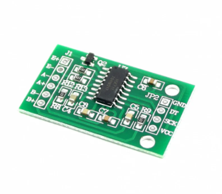 |
| Raspberry Pi | 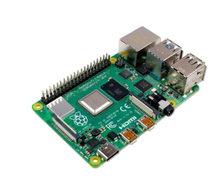 |
| Y3 Module | 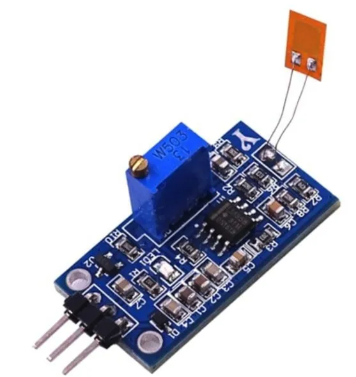 |

---

# Experimental Setup

<p align="center">
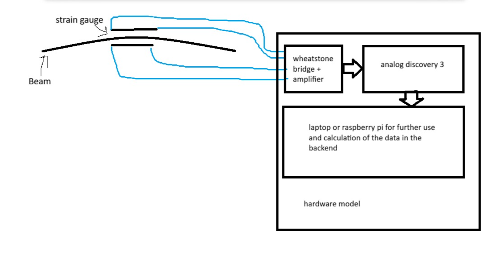
</p>


---

# Development Timeline

## Week 1

*Ideation and understanding of the problem  
development of basic idea to work on*

<p align="center">
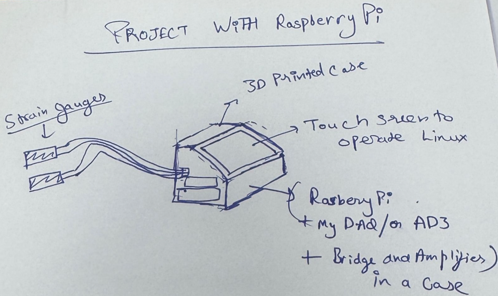
</p>
The Idea
  
---

## Week 2–3

*Hardware familiarization and Analog Discovery 3 integration*

<p align="center">
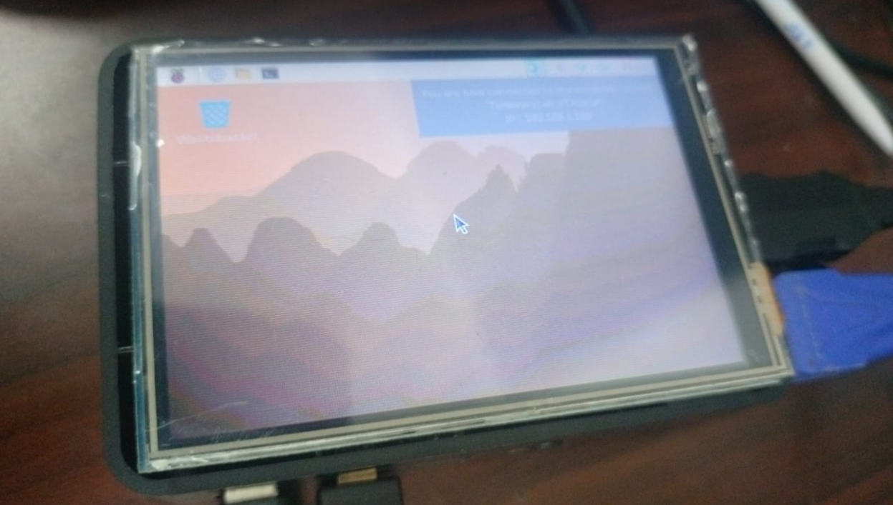
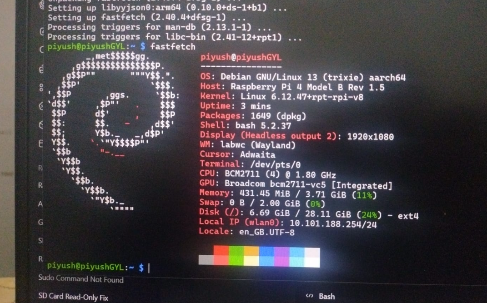
</p>

---

## Week 4

*GUI Development with python  
test codes documented on assigned folder*

<p align="center">
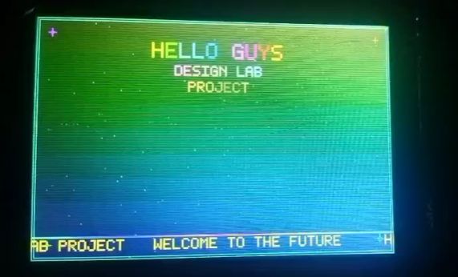
</p>

---

## Week 5–6

*Experimental testing and debugging*

<p align="center">
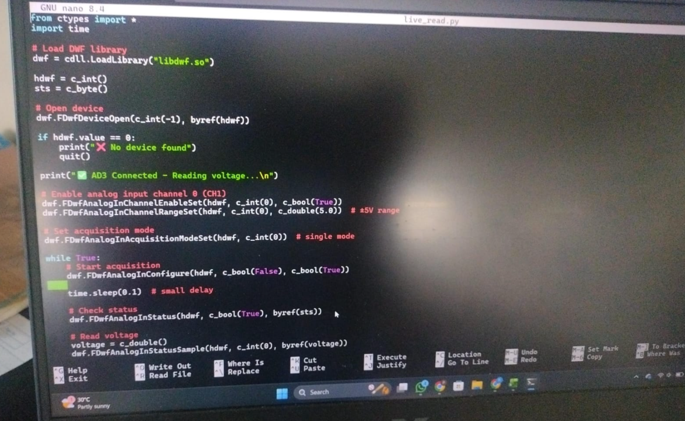
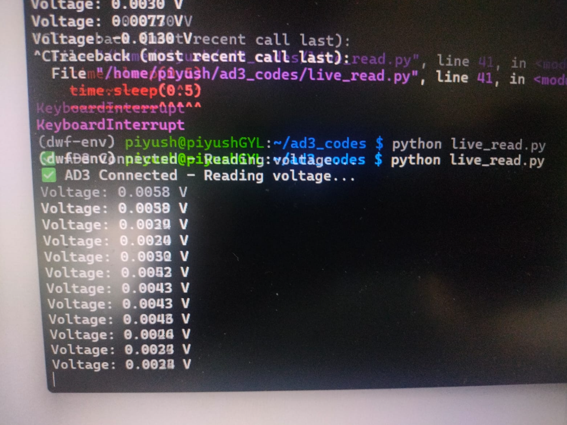
</p>

---

## Week 7

*After Y3 module failure and non availibility of that specific module we switched to a cutom bridge.  
Custom Wheatstone Bridge*

<p align="center">
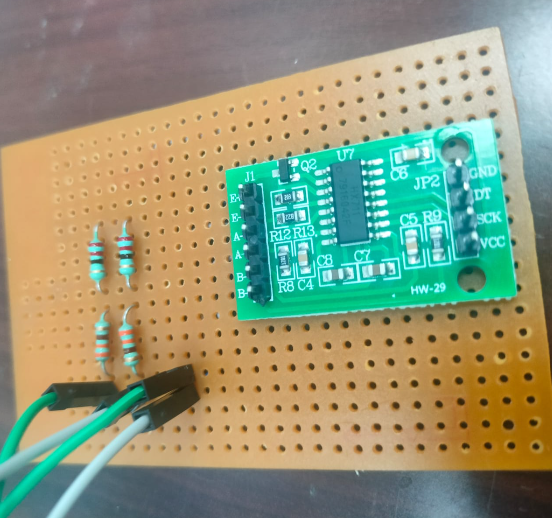
</p>

---

## Week 8

*calibrating with known weights*

<p align="center">
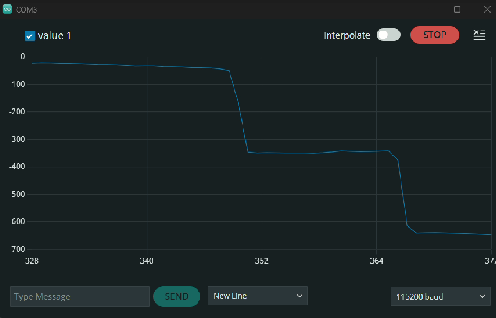
</p>

---

# Results


## Output Readings
*deflections for each 10g coin put at the end of beam*
<p align="center">
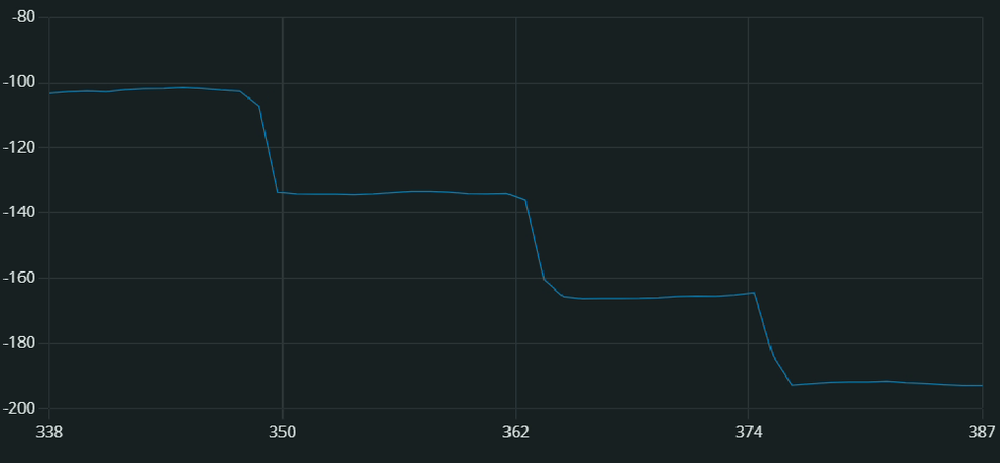
</p>

*strain is proportional to force at end for bending so these deflection can be mapped to strain by getting a correct proportionality constant*

---

# Future Improvements

- Automatic Young's Modulus calculation
- Temperature compensation
- Wireless monitoring
- Multi-channel acquisition
- PCB implementation
- Cloud dashboard
- Real-time plotting

---
